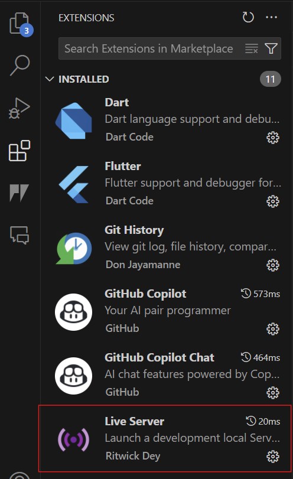
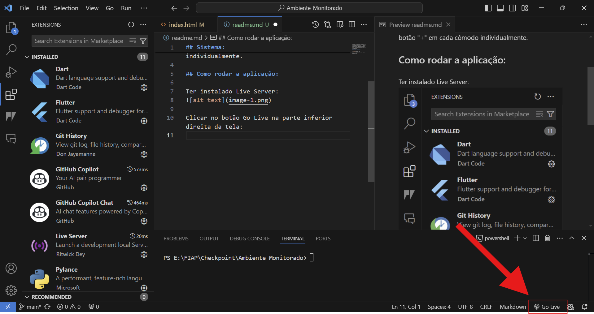
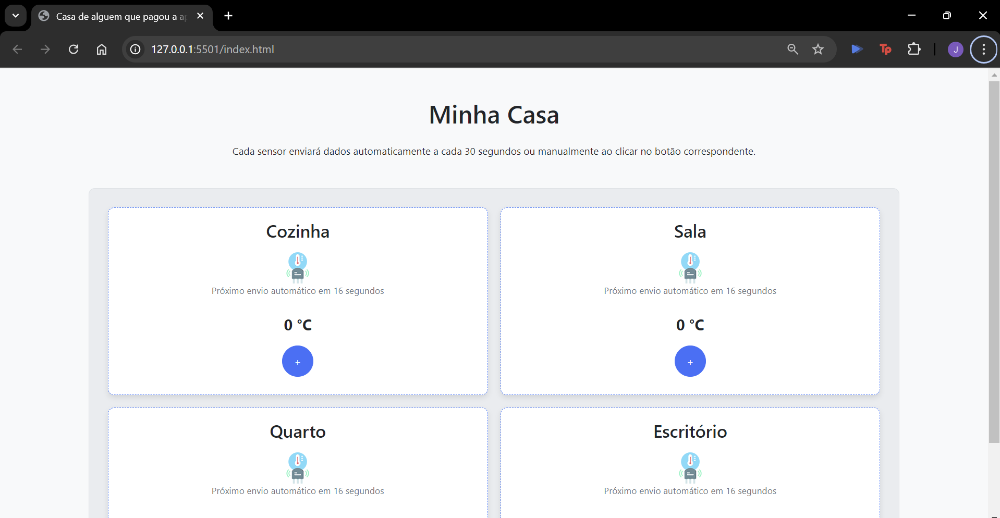

## Sistema:

O sistema foi desenvolvido para monitorar a temperatura de ambientes, sendo sala, cozinha, quarto e escritório. Os ambientes têm atualização automática a cada 30seg, além de um botão onde há possibilidade de enviar a atualização manualmente, onde está com o botão "+" em cada cômodo individualmente.

## Como rodar a aplicação:

Ter instalado Live Server: 

Clicar no botão Go Live na parte inferior direita da tela:

Irá abrir o navegador e será possível visualizar a aplicação:

## Tecnologias aplicadas:

Linguagem de programação HTML;

Estilos de visualização CSS;

Sintaxe JavaScript;

Função de simulação de temperatura e humidade dos ambientes utilizando valores randomicos;

SIstema de autenticação para login e senha com token JWT - bcrypt;

Atualização automática a cada 30seg;

Envio manual por botão disponibilizado para o usuário;

Inclusão de bootstrap para fornecer funcionalidades adicionais como modais e dropdowns.

José Manuel Barbosa da Silva RM:557288

Samuel Victor Monteiro de Oliveira RM:552435

